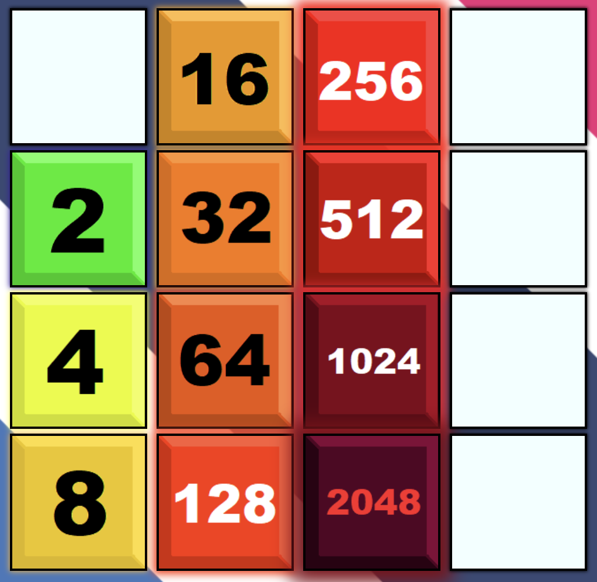
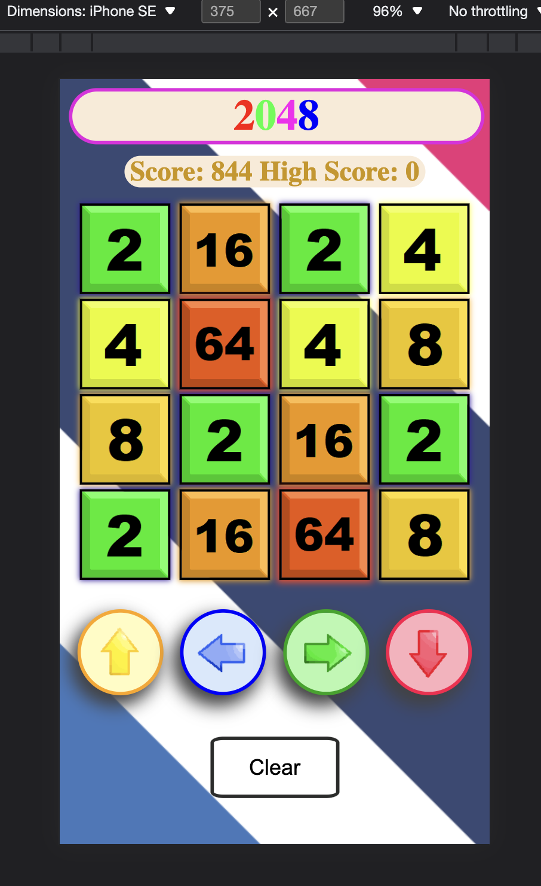

# 2048 
[Link to github pages](https://kan5661.github.io/2048/)
### Description
This is a 4 by 4 game with the objective of trying to combine blocks into one with a sum of 2048. 

Colored Blocks

Responsive

### Technical Requirements
- A browser

### Technologies Used
- HTML
- CSS
- Javascript

### Future Features
- Create animation for combine so the users can actually see what's happening
- Add themes
- Sounds

### MVP Goals
- As the user, I want to be able combine by pressing the WASD keys or with the buttons on the browser.
- As the user, I want to be able to see my current and highest score.
- As the user, I want to be able to click/press the 'clear' button and have the all the squares and score to be reset and have my high score updated if I obtained a new high score.